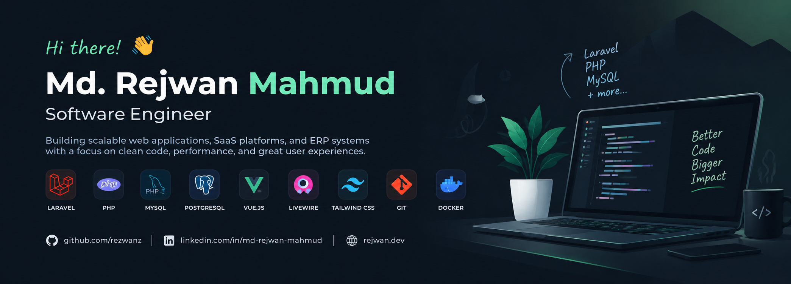

<div align="center">



### 👋 Hi there, I'm Md. Rejwan Mahmud

**Software Engineer · Backend Engineer · Full-Stack Developer**

<p>
  <a href="https://github.com/rezwanz">GitHub</a> ·
  <a href="https://www.linkedin.com/in/md-rejwan-mahmud">LinkedIn</a> ·
  <a href="mailto:rejwan.dev24@gmail.com">Email</a> ·
  <a href="https://rejwan.dev/">Portfolio</a>
</p>


</div>

---


## 🧑‍💻 About Me

I'm a **backend-focused Software Engineer with 4+ years of experience** building multi-tenant SaaS platforms, ERP systems, CRM solutions, booking platforms, and business applications.

My primary experience is centered around **Laravel and PHP**, with hands-on work across **Livewire, Vue.js, JavaScript, relational database design, API development, and production systems**.

I enjoy turning real business requirements into maintainable software — designing database structures, improving query performance, implementing backend logic, integrating frontend experiences, and supporting reliable production releases.

### What I work on

- 🏗️ Multi-tenant SaaS architecture
- ⚙️ Laravel & PHP backend development
- 🗄️ Database design and query optimization
- 🔌 RESTful APIs and system integrations
- 🧾 ERP, CRM, accounting, invoicing, and business systems
- 🏨 Hotel, property, and travel booking platforms
- 🖥️ Full-stack web applications
- 🚨 Production debugging and critical issue resolution

---

## 🛠️ Tech Stack

### Frontend


### Backend


### Database, Tools & DevOps


---

## 💼 Professional Experience

### Software Engineer — Codeware Limited
**May 2025 – Present**

- Develop and maintain backend features, resolve critical production issues, and optimize database structures and queries for scalability and performance.
- Provide technical support for critical production issues, troubleshoot system failures, and participate in client meetings to understand requirements and deliver effective solutions.
- Collaborate with frontend and backend teams to ensure seamless system integration, maintain code quality, and deliver reliable releases.

### Software Engineer — Skylark Soft Limited
**April 2024 – April 2025**

- Developed and maintained backend and frontend features for ERP modules based on business and functional requirements.
- Refactored core ERP modules to improve processing performance and reduce database query load.
- Resolved critical bugs and documented technical findings to improve module stability and maintainability.
- Redesigned key database structures to support scalability as client data volume grew.
- Provided technical support for high-priority client issues and production incidents.

### Jr. Software Engineer — DevTechGuru
**February 2023 – March 2024**

- Developed backend and frontend features across CRM, ERP, and web portal projects.
- Triaged and resolved bugs, improving system reliability.
- Designed relational database schemas for new modules, focusing on data integrity and query efficiency.
- Contributed to code reviews and documentation to support long-term maintainability.
- Provided support during critical production incidents.

### Trainee Software Engineer — DevTechGuru
**August 2022 – January 2023**

Assisted with early-stage web application development and gained hands-on experience in software engineering practices, debugging, and collaborative development.

### Software Development Engineer (Intern) — Excellent Soft Ltd.
**January 2022 – April 2022**

- Worked with senior developers to build web applications and responsive, cross-browser-compatible interfaces.
- Conducted software testing and debugging to identify and resolve issues and maintain application quality.

---

## 🚀 Selected Projects

### 🏨 Property Management System (PMS)

A **multi-tenant SaaS Hotel PMS** built around a **DB-per-tenant architecture**, with two applications:

- **Super Admin** — tenant onboarding, billing, and global hotel data
- **Tenant PMS** — front desk, reservations, guest CRM, POS, night audit, and accounting

**Stack:** HTML · CSS · Tailwind CSS · TypeScript · Inertia.js · Vite · Vue.js · PHP · Laravel · Redis · MySQL

**Associated with:** Codeware Limited

---

### 🧾 Visa Agency CRM & Management System

A multilingual **AR/BN/EN, multi-tenant CRM** combining a public-facing marketing website with a back-office platform for:

- Customer management
- Invoicing and payments
- Commission tracking
- Double-entry accounting
- Financial reporting

**Stack:** HTML · CSS · Tailwind CSS · Alpine.js · Vite · JavaScript · PHP · Laravel · Livewire · MySQL

**Associated with:** Codeware Limited — client: Al Zahra Consultancy

[Visit project →](https://alzahrabd.com/)

---

### 🏥 Bangladesh Medical University (BMU)

A university administration and research platform featuring:

- End-to-end IRB ethics approval workflow
- Academic and Syndicate meeting governance portals
- Signed attendance confirmation
- Multilingual EN/BN CMS
- Per-department subdomains
- News publishing

**Stack:** HTML · CSS · Tailwind CSS · Alpine.js · PHP · Laravel · Livewire · Filament · MySQL

**Associated with:** Codeware Limited

[Visit website →](https://www.bmu.ac.bd/)

---

### 🏨 Winrooms

A hotel and accommodation booking platform for searching, comparing, and booking rooms, with:

- Dynamic pricing
- Real-time availability
- Partner dashboards
- Property management functionality

**Stack:** HTML · CSS · Bootstrap · Tailwind CSS · Alpine.js · Vite · JavaScript · React · Next.js · Vue.js · PHP · Laravel · Livewire · Redis · MySQL

**Associated with:** Codeware Limited

[Visit project →](https://winrooms.com/)

---

### ✈️ Etripi

A hotel and tour booking platform for the Bangladesh market, including:

- Partner portal for rate and availability management
- Local payment gateway integration
- Automated invoicing
- Dedicated tour booking module

**Associated with:** Codeware Limited

---

### 🧵 goRMG ERP

Developed ERP modules for the garments industry to streamline operations and contributed to **Protracker**, a cloud-based platform for managing:

- Orders
- Production
- Shipping
- Invoicing

---

### 🧪 Laboratory Information Management System (LIMS)

Developed features for a Laboratory Information Management System for the **Wyss Institute at Harvard**, supporting:

- Sample management
- Workflow automation
- Data integrity
- Research and testing operations

---

### 🌐 Wyss Diagnostics Accelerator (DxA)

Built the public-facing WordPress website for the Wyss Diagnostics Accelerator program at the Wyss Institute at Harvard, showcasing the initiative and its research focus.

[View website →](https://wyss.harvard.edu/collaboration/wyss-diagnostics-accelerator/)

---

### 🏭 GURU ERP

Developed a web-based ERP solution for **Three Arrows Plastic Factory (Saudi Arabia)** and **Uniglory Ltd.** to streamline business processes, improve interdepartmental efficiency, and enhance data management.

---

### 📝 CMS — QK Ahmad Foundation

Developed a web-based CMS for creating, editing, organizing, and publishing digital content, including text, images, and videos.

[Visit website →](https://qkaf.org/home.php)

---

## 🎯 Engineering Focus

I particularly enjoy working on:

- **Scalable architecture** — designing systems that can grow with users and data
- **Backend engineering** — business logic, APIs, integrations, and application structure
- **Database engineering** — relational schema design, query optimization, and data integrity
- **Business systems** — ERP, CRM, accounting, invoicing, booking, and operational workflows
- **Performance & reliability** — debugging bottlenecks and resolving production issues
- **Maintainability** — clean implementation, documentation, and sustainable codebases

```text
Business Requirements
        ↓
System & Database Design
        ↓
Backend Architecture
        ↓
Application Logic & APIs
        ↓
Frontend Integration
        ↓
Performance & Reliability
        ↓
Production Delivery
```

---

## 🎓 Education

### Executive Master in Information Technology
**University of Dhaka** · 2023–2025

Specialized in **Software Engineering and Data Science**

### B.Sc. in Computer Science and Engineering
**Independent University, Bangladesh** · 2017–2022

Focus: **Data Structures, Algorithms, Databases, and Software Engineering**

---

## 📜 Certifications

- **PHP with Laravel Framework** — BASIS · July 2022
- **Professional English Communication Skill** — WSDA New Zealand · June 2022
- **Introduction to Psychology** — Coursera · July 2020
- **Python Data Structures** — Coursera · July 2020
- **Introduction to HTML** — Coursera · July 2020
- **Programming for Everybody (Getting Started with Python)** — Coursera · June 2020

---

## 📊 GitHub Activity

<div align="center">

<a href="https://github.com/rezwanz">
  
</a>
<a href="https://github.com/rezwanz">
  
</a>

</div>

---

## 🤝 Let's Connect

I'm open to discussing **software engineering opportunities, backend development, SaaS systems, business applications, and interesting engineering problems**.

- 📧 [rejwan.dev24@gmail.com](mailto:rejwan.dev24@gmail.com)
- 💼 [LinkedIn](https://www.linkedin.com/in/md-rejwan-mahmud)
- 🐙 [GitHub @rezwanz](https://github.com/rezwanz)
- 🌐 [Portfolio](https://rejwan.dev/)
- 📍 Narayanganj, Bangladesh

<div align="center">

### Building practical software, one system at a time. 🚀

</div>
